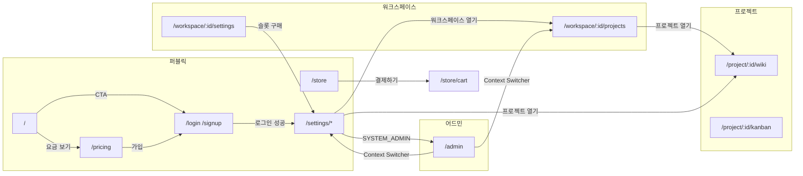

# 바은 워크스페이스 Information Architecture

프론트엔드 Vue Router(`frontend/src/routes/`)와 레이아웃·페이지 링크를 기준으로 현재 구현된 IA를 정리한다. 소스: `public.js`, `workspace.js`, `project.js`, `admin.js`, `router.js`, 각 사이트 레이아웃, `ContextSwicher.vue`.

분석 기준일: 2026-09-06.

---

## 1. 제품 구조

바은 워크스페이스는 단일 SPA 안에서 **네 개의 사이트**로 나뉜다. 각 사이트는 전용 레이아웃과 URL 네임스페이스를 가지며, 로그인 사용자의 계정 메뉴(Context Switcher)가 사이트 사이를 잇는다.

```
퍼블릭 사이트     /                     마케팅 · 인증 · 계정 · 스토어
워크스페이스 사이트 /workspace/:id        조직 허브 (프로젝트 · 게시판 · 랭킹 · 설정)
프로젝트 사이트    /project/:id          협업 도구 (위키 · 칸반 · 메신저 · 데이터)
어드민 사이트      /admin                시스템 백오피스 (SYSTEM_ADMIN)
```

계층 관계는 계정 → 워크스페이스 → 프로젝트이다.

```
Member (계정)
 └── Workspace (조직)
      └── Project (협업 공간)
           ├── Wiki
           ├── Kanban
           ├── Channel
           └── Data
```

퍼블릭 사이트의 `/settings`는 계정 단위 설정이다. 워크스페이스·프로젝트 설정과 별개다.

---

## 2. 사이트맵

```
/  퍼블릭 사이트 (PublicLayout)
├── /                         소개(랜딩)
├── /pricing                  요금제
├── /store                    슬롯 스토어
│   └── /store/cart           장바구니
├── /login                    로그인
├── /signup                   회원가입
│   └── /signup/complete      가입 완료
├── /not-found                명시적 404
└── /settings                 계정 설정 (로그인 필요, SettingsLayout)
    ├── /settings             → /settings/profile
    ├── /settings/profile     프로필
    ├── /settings/security    계정 보안
    ├── /settings/plan        플랜 및 구독
    ├── /settings/billing     결제 내역
    ├── /settings/workspaces  워크스페이스 목록
    └── /settings/workspaces/:workspaceId  워크스페이스 상세

/workspace/:workspaceId  워크스페이스 사이트 (WorkspaceLayout, 로그인 필요)
├── /                     → /workspace/:id/projects
├── /projects             프로젝트 허브
├── /board                게시판 (WorkspaceBoardLayout)
│   ├── /                 → /board/home
│   ├── /home             게시판 홈
│   ├── /notice           공지사항
│   ├── /events           경조사
│   ├── /market           중고시장
│   └── /qna              묻고 답하기
├── /rank                 랭킹
└── /settings             워크스페이스 설정 (WorkspaceSettingsLayout)
    ├── /                 기본 정보 (alias: /general)
    ├── /members          멤버 관리
    ├── /projects         프로젝트 관리
    ├── /license          라이선스
    └── /billing          결제 관리

/project/:projectId  프로젝트 사이트 (ProjectLayout, 프로젝트 멤버 필요)
├── /forbidden            접근 거부 (레이아웃 밖)
├── /                     → /wiki
├── /wiki                 위키 (WikiLayout)
│   ├── /                 위키 홈
│   ├── /files            파일
│   └── /:pageId          위키 페이지
├── /kanban               작업 보드 (KanbanLayout)
│   ├── /                 칸반 홈
│   ├── /gantt            간트
│   ├── /archive          아카이브
│   ├── /backlog          백로그
│   ├── /:kanbanId        칸반 보드
│   ├── /:kanbanId/settings     칸반 설정
│   └── /:kanbanId/task/:taskId 태스크 상세
├── /channel              메신저 (ChannelLayout)
│   ├── /                 채널 홈
│   ├── /archive          아카이브
│   ├── /:roomId          채널 룸
│   └── /:roomId/settings 채널 설정
├── /data                 데이터 (DataLayout)
│   ├── /                 데이터 홈
│   ├── /:tableId/settings                  테이블 설정
│   └── /:tableId/:pageType(list|form|chart) 테이블 뷰
└── /settings             프로젝트 설정 (OWNER/ADMIN, ProjectSettingsLayout)
    ├── /                 기본 설정
    ├── /member           구성원 관리
    ├── /permissions      권한 신청 관리
    └── /notifications    알림 내역

/admin  어드민 사이트 (AdminLayout, SYSTEM_ADMIN)
├── /                     → /admin/dashboard
├── /dashboard            대시보드
├── /members              회원가입 승인
├── /users                사용자·워크스페이스
├── /billing              결제
├── /notifications        시스템 알림
└── /licenses             라이선스 카탈로그
    ├── /workspace        워크스페이스 라이선스 사용량
    ├── /project          프로젝트 라이선스 사용량
    └── /workspace-member 워크스페이스 멤버 라이선스 사용량
```

---

## 3. 내비게이션 시스템

사이트를 가로지르는 전환 축은 네 가지다.

| 축 | 위치 | 역할 |
|---|---|---|
| GNB | 각 사이트 헤더 | 사이트 내부 1차 메뉴 |
| LNB / SNB | 설정·보드·도구 레이아웃 사이드 | 2차·3차 메뉴 |
| Context Switcher | 모든 인증 GNB 우측 | 사이트 간 이동 (계정 · 워크스페이스 · 프로젝트 · 어드민) |
| 인페이지 링크 | 카드, CTA, 알림, 검색 | 리소스 딥링크 |

### 3.1 Context Switcher (전역 허브)

구현: `frontend/src/components/ContextSwicher.vue`. 퍼블릭·워크스페이스·프로젝트·어드민 GNB에 공통으로 붙는다. 비로그인 사용자는 보이지 않는다.

| 항목 | 목적지 |
|---|---|
| 내 프로필 | `/settings/profile` |
| 관리자 콘솔 (`SYSTEM_ADMIN`만) | `/admin` |
| 워크스페이스 이름 | `/workspace/:workspaceId` |
| 하위 프로젝트 이름 | `/project/:projectId` |
| 워크스페이스 없음 | `/settings/workspaces` |
| 로그아웃 | `/login` |

이 메뉴가 네 사이트를 잇는 유일한 전역 내비게이션이다. 프로젝트 GNB에는 소속 워크스페이스로 돌아가는 명시 링크가 없고, 퍼블릭 GNB에도 워크스페이스 진입 링크가 없다.

### 3.2 퍼블릭 GNB / Footer

레이아웃: `PublicLayout.vue`.

| 영역 | 라벨 | 경로 | 조건 |
|---|---|---|---|
| 브랜드 | 바은 워크스페이스 | `/` | 상시 |
| 메인 | 소개 | `/` | 상시 |
| 메인 | 스토어 | `/store` | 상시 |
| 유틸 | 회원가입 | `/signup` | 비로그인 |
| 유틸 | 로그인 | `/login` | 비로그인 |
| 유틸 | 장바구니 | `/store/cart` | 로그인 |
| 유틸 | 계정 메뉴 | Context Switcher | 로그인 |
| Footer | 요금제 | `/pricing` | 상시 |
| Footer | 기능 | `/#features` | 상시 |
| Footer | 문의 | `#` (동작 없음) | 상시 |

요금제는 GNB가 아니라 Footer에만 있다. 랜딩 CTA는 `/signup`, `/pricing`으로 나간다.

### 3.3 계정 설정 LNB

레이아웃: `SettingsLayout.vue`. 퍼블릭 레이아웃 안에서 `/settings/*`만 감싼다.

| 라벨 | 경로 |
|---|---|
| 프로필 | `/settings/profile` |
| 계정 보안 | `/settings/security` |
| 플랜 및 구독 | `/settings/plan` |
| 결제 내역 | `/settings/billing` |
| 워크스페이스 | `/settings/workspaces` |

### 3.4 워크스페이스 GNB / 게시판 SNB / 설정 LNB

레이아웃: `WorkspaceLayout.vue`.

| 영역 | 라벨 | 경로 |
|---|---|---|
| 브랜드 | 워크스페이스 이름 | `/workspace/:id/projects` |
| 메인 | 프로젝트 | `/workspace/:id/projects` |
| 메인 | 게시판 | `/workspace/:id/board` → `/board/home` |
| 메인 | 랭킹 | `/workspace/:id/rank` |
| 유틸 | 설정 | `/workspace/:id/settings` |
| 유틸 | 계정 메뉴 | Context Switcher |

게시판 SNB (`WorkspaceBoardLayout.vue`):

| 그룹 | 라벨 | 경로 |
|---|---|---|
| — | 게시판 홈 | `/board/home` |
| — | 공지사항 | `/board/notice` |
| 커뮤니티 | 경조사 | `/board/events` |
| 정보 | 중고시장 | `/board/market` |
| 정보 | 묻고 답하기 | `/board/qna` |

워크스페이스 설정 LNB (`WorkspaceSettingsLayout.vue`):

| 라벨 | 경로 |
|---|---|
| 기본 정보 | `/workspace/:id/settings/general` |
| 멤버 관리 | `/workspace/:id/settings/members` |
| 프로젝트 관리 | `/workspace/:id/settings/projects` |
| 라이선스 | `/workspace/:id/settings/license` |
| 결제 관리 | `/workspace/:id/settings/billing` |

FAB(빠른 액션: 게시글 작성, 프로젝트 생성, 설정)는 토스트만 띄우며 라우트로 연결되지 않는다.

### 3.5 프로젝트 GNB / 도구 LNB / 설정 LNB

레이아웃: `ProjectLayout.vue`.

| 영역 | 라벨 | 경로 | 조건 |
|---|---|---|---|
| 브랜드 | 프로젝트 이름 | `/project/:id` → `/wiki` | 상시 |
| 메인 | 위키 | `/project/:id/wiki` | 상시 |
| 메인 | 작업 보드 | `/project/:id/kanban` | 상시 |
| 메인 | 메신저 | `/project/:id/channel` | 상시 (미읽음 점) |
| 메인 | 데이터 | `/project/:id/data` | 상시 |
| 유틸 | 검색 | 결과 선택 시 딥링크 | 상시 |
| 유틸 | 설정 | `/project/:id/settings` | OWNER / ADMIN |
| 유틸 | 챗봇 | 모달 (라우트 아님) | 상시 |
| 유틸 | 알림 | 드롭다운 + 딥링크 | 상시 |
| 유틸 | 계정 메뉴 | Context Switcher | 상시 |

검색 결과 경로 (`projectSearchStore.js`):

| 타입 | 경로 |
|---|---|
| kanban | `/project/:id/kanban/:kanbanId` |
| page | `/project/:id/wiki/:pageId` |
| channel | `/project/:id/channel/:roomId` |
| task | `/project/:id/kanban/:kanbanId/task/:taskId` |

알림 경로 (`notificationNav.js`):

| 알림 유형 | 경로 |
|---|---|
| `page_permission_request` | `/project/:id/settings/permissions` |
| `page_permission_resolved` | `/project/:id/wiki/:pageId` |
| `issue.assigned_to_me` | `/project/:id/kanban/:kanbanId/task/:taskId` |
| resource_type `channel` | `/project/:id/channel/:channelId` |
| resource_type `issue` 또는 기타 | `/project/:id/kanban` |
| 알림 내역 | `/project/:id/settings/notifications` |

위키 LNB: 페이지 트리(`/wiki/:pageId`) + 파일(`/wiki/files`).

칸반 LNB: 활성 보드(`/kanban/:kanbanId`) + 백로그 + 간트 + 하단 아카이브.

채널 LNB: 유형별 섹션(공지 · 일반 · 태스크 · DM · 에이전트) + 하단 아카이브.

데이터 LNB: Workspace Assets / Project Assets → `/data/:tableId/list`.

프로젝트 설정 LNB:

| 라벨 | 경로 |
|---|---|
| 기본 설정 | `/project/:id/settings` |
| 구성원 관리 | `/project/:id/settings/member` |
| 권한 신청 관리 | `/project/:id/settings/permissions` |
| 알림 내역 | `/project/:id/settings/notifications` |

### 3.6 어드민 GNB / LNB

레이아웃: `AdminLayout.vue`.

GNB는 브랜드 텍스트 `Baeun Admin`과 Context Switcher만 있다. LNB가 본 메뉴다.

| 라벨 | 경로 |
|---|---|
| Dashboard | `/admin/dashboard` |
| Members | `/admin/members` |
| Users & Workspaces | `/admin/users` |
| Billing | `/admin/billing` |
| Licenses | `/admin/licenses` |
| Notifications | `/admin/notifications` |

라이선스 사용량 페이지(`/licenses/workspace|project|workspace-member`)는 LNB에 없고, 카탈로그에서 리소스 타입별로 들어간다.

---

## 4. 사이트별 화면

### 4.1 퍼블릭 사이트

마케팅·가입·계정·구매가 한 네임스페이스에 있다. 계정 설정만 `requiresAuth`다.

| 경로 | 화면 | 목적 | 주요 링크 |
|---|---|---|---|
| `/` | HomeView | 랜딩. Hero / 파편화된 하루 / 통합 / 클로징 | `/signup`, `/pricing`, `/#features` |
| `/pricing` | PricingView | 슬롯 단가, 무료 한도, 계산기, FAQ | `/signup` |
| `/store` | StorePage | 워크스페이스·프로젝트·멤버 슬롯 구매 | `/pricing`, `/store/cart?productCode=` |
| `/store/cart` | CartPage | 수량·결제 | 스토어에서 query로 진입 |
| `/login` | LoginPage | 로그인 | `/signup`. 성공 시 워크스페이스 있으면 `/settings/workspaces`, 없으면 `/` |
| `/signup` | SigupPage | 회원가입 | `/login`. 성공 시 `/signup/complete` |
| `/signup/complete` | SignupCompletePage | 가입 완료·승인 대기 안내 | `/login`, `/` |
| `/not-found` | NotFoundPage | 명시적 404 | `/settings/workspaces`, `/` |
| `/settings/profile` | ProfilePage | 프로필·테마·탈퇴 | — |
| `/settings/security` | SecurityPage | 비밀번호 변경 | — |
| `/settings/plan` | PlanLicensePage | 보유 플랜 안내. 워크스페이스 라이선스 화면에서 query로 진입 | — |
| `/settings/billing` | BillingPage | 계정 결제 내역 | — |
| `/settings/workspaces` | WorkspaceListPage | 내 워크스페이스·프로젝트 목록, 생성·삭제 | 상세 `/settings/workspaces/:id`, 프로젝트 `/project/:id` |
| `/settings/workspaces/:workspaceId` | WorkspaceDetailPage | 계정 관점 워크스페이스 상세 | 목록, `/workspace/:id`, `/project/:id` |

로그인 후 기본 착지는 워크스페이스 사이트가 아니라 계정 설정의 워크스페이스 목록이다.

### 4.2 워크스페이스 사이트

조직 허브. 협업 도구(위키·칸반·채널·데이터)는 여기 없고 프로젝트로 내려간다.

| 경로 | 화면 | 목적 | 주요 링크 |
|---|---|---|---|
| `/workspace/:id` | redirect | 프로젝트 허브로 | `/projects` |
| `/projects` | WorkspaceProjectsPage | 참여 프로젝트 현황·진입 | `/project/:projectId` |
| `/board/*` | 게시판 5면 | 사내 게시판. 현재 와이어프레임 | SNB 내부만 |
| `/rank` | WorkspaceRankPage | 기여 랭킹. 현재 와이어프레임 | — |
| `/settings` | WorkspaceSettingsPage | 이름·이미지·테마 | alias `/settings/general` |
| `/settings/members` | WorkspaceSettingsMembersPage | 멤버 초대·역할 | — |
| `/settings/projects` | WorkspaceSettingsProjectsPage | 프로젝트 생성·관리 | — |
| `/settings/license` | WorkspaceSettingsLicensePage | 슬롯 사용량 | `/settings/plan?resource=&workspaceId=` |
| `/settings/billing` | WorkspaceSettingsBillingPage | 워크스페이스 결제 상태 | `/settings/plan`, `/settings/billing` |

라이선스·결제는 워크스페이스에서 보고, 구매·영수증은 퍼블릭 계정 설정으로 보낸다.

### 4.3 프로젝트 사이트

기본 작업 공간. 루트는 위키로 보낸다.

| 경로 | 화면 | 목적 | 주요 링크 |
|---|---|---|---|
| `/project/:id/forbidden` | ProjectForbiddenPage | 비멤버 차단. PublicLayout 밖 | `/settings/workspaces`, `/` |
| `/project/:id` | redirect | 위키 홈 | `/wiki` |
| `/wiki` | WikiHomePage | 최근 페이지 | `/wiki/:pageId` |
| `/wiki/files` | WikiFilesPage | 첨부 파일 | — |
| `/wiki/:pageId` | WikiPage | 문서 편집 | 삭제 후 `/wiki` |
| `/kanban` | KanbanHomePage | 최근 이슈 | `/kanban/:id/task/:taskId` |
| `/kanban/gantt` | GanttPage | 일정 | 태스크 상세 |
| `/kanban/archive` | KanbanArchivePage | 보관 보드 | `/kanban/:kanbanId` |
| `/kanban/backlog` | BacklogPage | 백로그 | — |
| `/kanban/:kanbanId` | KanbanPage | 보드 | `/kanban/:id/settings` |
| `/kanban/:kanbanId/settings` | KanbanSettingsPage | 보드 설정 | 삭제 후 `/kanban` |
| `/kanban/:kanbanId/task/:taskId` | TaskDetailPage | 이슈 상세 | 채널 룸, 보드로 복귀 |
| `/channel` | ChannelHomePage | 최근 메시지 | `/channel/:roomId` |
| `/channel/archive` | ChannelArchivePage | 보관 채널·이슈 | 채널 룸, 태스크 상세 |
| `/channel/:roomId` | ChannelRoomPage | 채팅 | 연결 이슈, `/channel/:id/settings` |
| `/channel/:roomId/settings` | ChannelSettingsPage | 채널 멤버·보관 | `/channel`, `/channel/:id` |
| `/data` | DataHomePage | 테이블 목록 | `/data/:tableId/list` |
| `/data/:tableId/settings` | DataTableSettingsPage | 스키마 | `/data/:id/list`, `/data` |
| `/data/:tableId/list` | DataTablePage | 행 목록 | `/data/:id/settings` |
| `/data/:tableId/form`, `/chart` | DataTablePage | 플레이스홀더 | — |
| `/settings` | ProjectSettingsHomePage | 이름·설명·삭제 | 삭제 후 `/settings/workspaces/:id` |
| `/settings/member` | ProjectSettingsMemberPage | 프로젝트 멤버 | — |
| `/settings/permissions` | ProjectSettingsPermissionsPage | 위키 편집 권한 신청 | `/wiki/:pageId` |
| `/settings/notifications` | NotificationHistoryPage | 알림 기록 | `resolveNotificationPath` |

채널 룸 LNB 섹션: NOTICE, GENERAL, TASK, DM, AGENT. TASK 채널은 칸반 이슈와 연결된다.

### 4.4 어드민 사이트

시스템 운영. `requiresAdmin` + `role_name === SYSTEM_ADMIN`. 실패 시 `/`로 보낸다.

| 경로 | 화면 | 목적 | 주요 링크 |
|---|---|---|---|
| `/admin` | redirect | 대시보드 | `/admin/dashboard` |
| `/dashboard` | AdminDashboardPage | 가입자·워크스페이스·매출. 현재 플레이스홀더 | — |
| `/members` | AdminMemberApprovalPage | 회원가입 승인·거절 | — |
| `/users` | AdminUserWorkspacePage | 회원·워크스페이스 조회 | — |
| `/billing` | AdminBillingPage | 결제 모니터링 | — |
| `/notifications` | AdminNotificationPage | 시스템 알림 발송 | — |
| `/licenses` | AdminLicenseCatalogPage | 라이선스 마스터 | 사용량 3면 |
| `/licenses/workspace` | AdminLicenseWorkspaceUsagePage | 워크스페이스 슬롯 사용 | 카탈로그 |
| `/licenses/project` | AdminLicenseProjectUsagePage | 프로젝트 슬롯 사용 | 카탈로그 |
| `/licenses/workspace-member` | AdminLicenseWorkspaceMemberUsagePage | 멤버 슬롯 사용 | 카탈로그 |

---

## 5. 교차 사이트 흐름



### 주요 사용자 여정

1. **가입**  
   `/` 또는 `/pricing` → `/signup` → `/signup/complete` → (어드민 `/admin/members` 승인) → `/login`.

2. **로그인 후 착지**  
   워크스페이스가 있으면 `/settings/workspaces`, 없으면 `/`. 워크스페이스 사이트로는 바로 가지 않는다.

3. **워크스페이스 진입**  
   Context Switcher, 또는 `/settings/workspaces/:id`의 「워크스페이스 열기」.

4. **프로젝트 진입**  
   Context Switcher, 워크스페이스 프로젝트 허브, 계정 워크스페이스 목록/상세. 착지는 `/project/:id` → `/wiki`.

5. **슬롯 구매**  
   마케팅: `/pricing` → `/store` → `/store/cart`.  
   운영: 워크스페이스 라이선스/결제 → `/settings/plan`, `/settings/billing`.

6. **권한 없는 프로젝트**  
   가드가 `/project/:id/forbidden`으로 보낸다. 복귀는 계정 워크스페이스 목록 또는 랜딩.

7. **프로젝트 삭제**  
   `/settings/workspaces/:workspaceId`로 돌아간다. 워크스페이스 사이트가 아니다.

---

## 6. 접근 제어와 리다이렉트

가드: `frontend/src/router.js`.

| 메타 | 적용 | 실패 시 |
|---|---|---|
| `requiresAuth` | `/settings/*`, `/workspace/:id/*`, `/admin/*` | `/login` |
| `requiresAdmin` | `/admin/*` | `/` |
| `requiresProjectMember` | `/project/:id/*` (forbidden 제외) | `/project/:id/forbidden` |
| `requiresProjectAdmin` | `/project/:id/settings/*` | `/project/:id/kanban` |

역할:

| 범위 | 역할 | 화면 영향 |
|---|---|---|
| 전역 `member.role_name` | `SYSTEM_ADMIN` | 어드민 진입, Context Switcher에 관리자 콘솔 |
| 워크스페이스 | OWNER / ADMIN / MEMBER | 설정 변경·초대는 OWNER/ADMIN |
| 프로젝트 | OWNER / ADMIN / MEMBER | 설정 GNB·`/settings`는 OWNER/ADMIN |
| 페이지 | OWNER / EDITOR / VIEWER | 위키 편집 권한 신청 흐름 |
| 채널 | OWNER / ADMIN / MEMBER | 공지 채널 작성 제한 |

리다이렉트:

| From | To |
|---|---|
| `/settings` | `/settings/profile` |
| `/workspace/:id` | `/workspace/:id/projects` |
| `/workspace/:id/board` | `/workspace/:id/board/home` |
| `/workspace/:id/settings` | 같은 화면, alias `/general` |
| `/project/:id` | `/project/:id/wiki` |
| `/admin` | `/admin/dashboard` |

리소스 조회 404(위키·칸반·채널 등)는 `/not-found`로 보낸다. 라우터에 `/:pathMatch(.*)*` 캐치올은 없다. 미등록 URL은 빈 화면이 될 수 있다.

`/project/:id/forbidden`은 PublicLayout·ProjectLayout 모두 밖이라 GNB가 없다.

---

## 7. URL 설계 규칙

| 규칙 | 내용 |
|---|---|
| 사이트 경계 | `/`, `/workspace/:id`, `/project/:id`, `/admin` |
| 프로젝트는 워크스페이스를 URL에 넣지 않음 | `/project/:projectId/...`. 워크스페이스 복귀는 Context Switcher |
| 도구는 프로젝트 1차 세그먼트 | `wiki`, `kanban`, `channel`, `data`, `settings` |
| 동적 세그먼트는 도구 홈 뒤에 | `:pageId`, `:kanbanId`, `:roomId`, `:tableId` |
| 설정은 항상 `settings` 하위 | 계정 `/settings`, 워크스페이스 `/workspace/:id/settings`, 프로젝트 `/project/:id/settings` |
| 아카이브는 도구 LNB 하단 | `/kanban/archive`, `/channel/archive` |
| 구매는 퍼블릭에 모음 | `/store`, `/store/cart`, `/settings/plan`, `/settings/billing` |

정적 경로와 동적 파라미터 충돌을 피한 예:

- `/kanban/gantt`, `/archive`, `/backlog`가 `/kanban/:kanbanId`보다 먼저 선언됨
- `/channel/archive`, `/channel/:roomId/settings`가 `/channel/:roomId`보다 먼저 선언됨
- `/data/:tableId/settings`가 `/data/:tableId/:pageType`보다 먼저 선언됨
- `/admin/licenses/workspace` 등이 `/admin/licenses` 하위로 분리됨

데이터 `pageType`은 `list|form|chart`만 허용한다.

---

## 8. 구현과 IA의 차이

라우트는 있으나 화면이 와이어프레임이거나, 파일은 있으나 라우트에 없는 항목.

| 항목 | 상태 |
|---|---|
| 워크스페이스 게시판 5면, 랭킹 | 라우트·GNB 있음. UI는 와이어프레임 |
| 워크스페이스 FAB | 라우트 없음. 토스트만 |
| `WorkspaceKanbanPage.vue` | 파일만 있음. `workspace.js`에 미등록 |
| 어드민 대시보드 | 플레이스홀더 통계 |
| 데이터 form/chart 뷰 | 라우트 있음. 「준비 중」 안내 |
| Footer 문의 | `href="#"` |
| 전역 캐치올 404 | 없음. `/not-found`만 명시 이동 |
| 프로젝트 → 워크스페이스 GNB | 없음. Context Switcher만 |
| 퍼블릭 GNB 요금제 | Footer·랜딩 CTA만 |
| `docs/baun_workspace_sitemap.json` | 구상안. 실제 URL은 `/project/:id/wiki` 등 |

---

## 9. 페이지 인벤토리

라우트 모듈 기준. 리다이렉트 제외.

### 퍼블릭 (`routes/public.js`)

| 경로 | 인증 | 뷰 |
|---|---|---|
| `/` | 공개 | HomeView |
| `/pricing` | 공개 | PricingView |
| `/store` | 공개 | StorePage |
| `/store/cart` | 공개 | CartPage |
| `/not-found` | 공개 | NotFoundPage |
| `/login` | 공개 | LoginPage |
| `/signup` | 공개 | SigupPage |
| `/signup/complete` | 공개 | SignupCompletePage |
| `/settings/profile` | 로그인 | ProfilePage |
| `/settings/security` | 로그인 | SecurityPage |
| `/settings/plan` | 로그인 | PlanLicensePage |
| `/settings/billing` | 로그인 | BillingPage |
| `/settings/workspaces` | 로그인 | WorkspaceListPage |
| `/settings/workspaces/:workspaceId` | 로그인 | WorkspaceDetailPage |

### 워크스페이스 (`routes/workspace.js`)

| 경로 | 인증 | 뷰 |
|---|---|---|
| `/workspace/:workspaceId/projects` | 로그인 | WorkspaceProjectsPage |
| `/workspace/:workspaceId/board/home` | 로그인 | WorkspaceBoardHomePage |
| `/workspace/:workspaceId/board/notice` | 로그인 | WorkspaceBoardNoticePage |
| `/workspace/:workspaceId/board/events` | 로그인 | WorkspaceBoardCelebrationPage |
| `/workspace/:workspaceId/board/market` | 로그인 | WorkspaceBoardMarketPage |
| `/workspace/:workspaceId/board/qna` | 로그인 | WorkspaceBoardQnaPage |
| `/workspace/:workspaceId/rank` | 로그인 | WorkspaceRankPage |
| `/workspace/:workspaceId/settings` | 로그인 | WorkspaceSettingsPage |
| `/workspace/:workspaceId/settings/members` | 로그인 | WorkspaceSettingsMembersPage |
| `/workspace/:workspaceId/settings/projects` | 로그인 | WorkspaceSettingsProjectsPage |
| `/workspace/:workspaceId/settings/license` | 로그인 | WorkspaceSettingsLicensePage |
| `/workspace/:workspaceId/settings/billing` | 로그인 | WorkspaceSettingsBillingPage |

### 프로젝트 (`routes/project.js`)

| 경로 | 인증 | 뷰 |
|---|---|---|
| `/project/:projectId/forbidden` | 없음(가드 결과) | ProjectForbiddenPage |
| `/project/:projectId/wiki` | 프로젝트 멤버 | WikiHomePage |
| `/project/:projectId/wiki/files` | 프로젝트 멤버 | WikiFilesPage |
| `/project/:projectId/wiki/:pageId` | 프로젝트 멤버 | WikiPage |
| `/project/:projectId/kanban` | 프로젝트 멤버 | KanbanHomePage |
| `/project/:projectId/kanban/gantt` | 프로젝트 멤버 | GanttPage |
| `/project/:projectId/kanban/archive` | 프로젝트 멤버 | KanbanArchivePage |
| `/project/:projectId/kanban/backlog` | 프로젝트 멤버 | BacklogPage |
| `/project/:projectId/kanban/:kanbanId` | 프로젝트 멤버 | KanbanPage |
| `/project/:projectId/kanban/:kanbanId/settings` | 프로젝트 멤버 | KanbanSettingsPage |
| `/project/:projectId/kanban/:kanbanId/task/:taskId` | 프로젝트 멤버 | TaskDetailPage |
| `/project/:projectId/channel` | 프로젝트 멤버 | ChannelHomePage |
| `/project/:projectId/channel/archive` | 프로젝트 멤버 | ChannelArchivePage |
| `/project/:projectId/channel/:roomId` | 프로젝트 멤버 | ChannelRoomPage |
| `/project/:projectId/channel/:roomId/settings` | 프로젝트 멤버 | ChannelSettingsPage |
| `/project/:projectId/data` | 프로젝트 멤버 | DataHomePage |
| `/project/:projectId/data/:tableId/settings` | 프로젝트 멤버 | DataTableSettingsPage |
| `/project/:projectId/data/:tableId/:pageType` | 프로젝트 멤버 | DataTablePage |
| `/project/:projectId/settings` | 프로젝트 OWNER/ADMIN | ProjectSettingsHomePage |
| `/project/:projectId/settings/member` | 프로젝트 OWNER/ADMIN | ProjectSettingsMemberPage |
| `/project/:projectId/settings/permissions` | 프로젝트 OWNER/ADMIN | ProjectSettingsPermissionsPage |
| `/project/:projectId/settings/notifications` | 프로젝트 OWNER/ADMIN | NotificationHistoryPage |

알림 내역은 설정 LNB에 있으나, GNB 알림 드롭다운의 「이전 알림 보기」로 일반 멤버도 경로를 알 수 있다. 라우트 가드는 OWNER/ADMIN만 통과시킨다.

### 어드민 (`routes/admin.js`)

| 경로 | 인증 | 뷰 |
|---|---|---|
| `/admin/dashboard` | SYSTEM_ADMIN | AdminDashboardPage |
| `/admin/members` | SYSTEM_ADMIN | AdminMemberApprovalPage |
| `/admin/users` | SYSTEM_ADMIN | AdminUserWorkspacePage |
| `/admin/billing` | SYSTEM_ADMIN | AdminBillingPage |
| `/admin/notifications` | SYSTEM_ADMIN | AdminNotificationPage |
| `/admin/licenses` | SYSTEM_ADMIN | AdminLicenseCatalogPage |
| `/admin/licenses/workspace` | SYSTEM_ADMIN | AdminLicenseWorkspaceUsagePage |
| `/admin/licenses/project` | SYSTEM_ADMIN | AdminLicenseProjectUsagePage |
| `/admin/licenses/workspace-member` | SYSTEM_ADMIN | AdminLicenseWorkspaceMemberUsagePage |

---

## 10. 소스 맵

| IA 개념 | 파일 |
|---|---|
| 라우트 집합 | `frontend/src/routes/index.js` |
| 퍼블릭 라우트 | `frontend/src/routes/public.js` |
| 워크스페이스 라우트 | `frontend/src/routes/workspace.js` |
| 프로젝트 라우트 | `frontend/src/routes/project.js` |
| 어드민 라우트 | `frontend/src/routes/admin.js` |
| 가드·스크롤 | `frontend/src/router.js` |
| 전역 전환 메뉴 | `frontend/src/components/ContextSwicher.vue` |
| 알림 딥링크 | `frontend/src/lib/notificationNav.js` |
| 검색 딥링크 | `frontend/src/stores/projectSearchStore.js` |
| 역할 정의 | `docs/permissions.md` |
